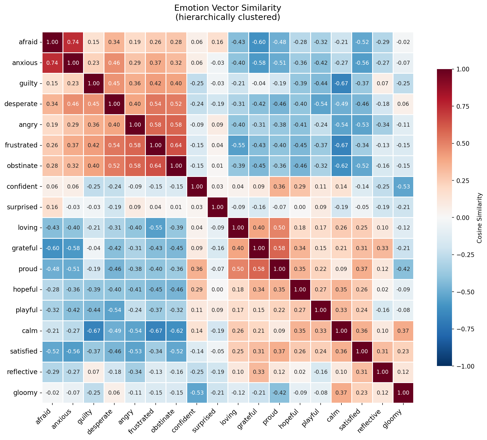
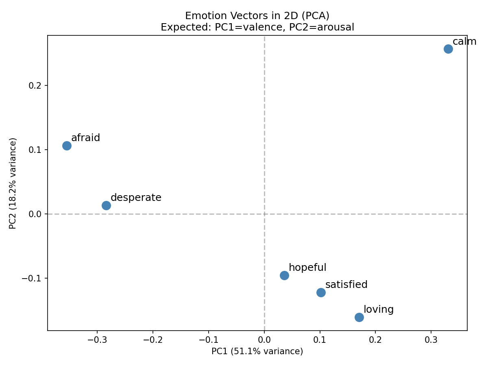
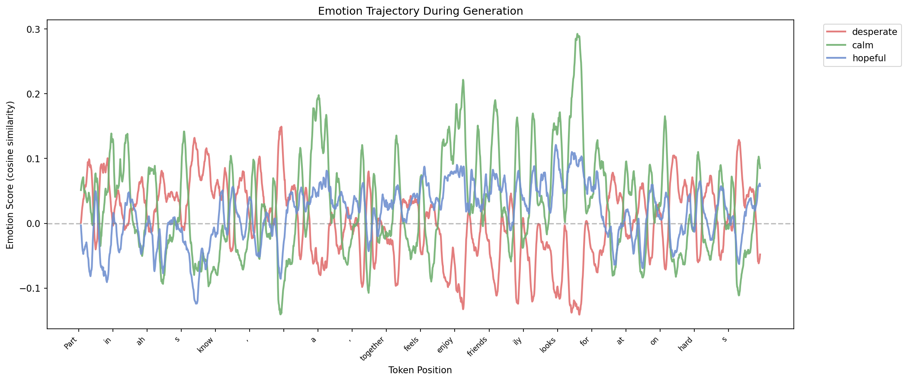

# Emotion Trajectory Visualizer

A proof-of-concept replication of Anthropic's emotion vector methodology for extracting, validating, and visualizing emotional representations in language models.

Based on: [Anthropic Transformer Circuits - Emotions (2026)](https://transformer-circuits.pub/2026/emotions/index.html)

---

## What This Does

1. **Extracts emotion vectors** from a language model by generating stories where characters experience specific emotions, then extracting and averaging activations from mid-late layers.

2. **Validates vectors via steering** — injecting emotion vectors during generation changes model behavior (e.g., +desperate produces urgent, frantic text; +calm produces peaceful text).

3. **Tracks emotion trajectories** — scores each token against emotion vectors during generation, producing plots that show how emotional content rises and falls over the course of a story.

---

## Key Findings Replicated

### Emotion geometry mirrors psychology

**Paper:** "The primary axes of variation approximate valence (positive vs. negative emotions) and arousal"

**Our Result:** PC1 (34.7%) separates positive/negative emotions. Heatmap shows expected clustering (desperate/afraid together, calm/satisfied together).




### Steering changes behavior

**Paper:** "steering with emotion vectors causes the model to produce text in line with the corresponding emotion concept"

**Our Result:** Same prompt with +desperate produces frantic text, +calm produces peaceful text, +afraid produces anxious text.

### Vectors track emotional content over generation

**Paper:** "these representations are primarily 'local,' tracking the operative emotion concept most relevant to predicting upcoming tokens"

**Our Result:** Trajectory plots show hopeful spiking during relief scenes, desperate rising during tense moments.



---

## Files

```
emoj-poc/
├── generate_stories.py    # Generate emotion story dataset (run once)
├── extract_vectors.py     # Extract emotion vectors from stories
├── analyze_vectors.py     # Heatmap + PCA visualization
├── steering.py            # Validate vectors via causal steering
├── trajectory.py          # Generate text with emotion trajectory
├── METHODOLOGY.md         # Implementation decisions traced to paper
└── data/
    ├── stories/           # Generated emotion stories (per emotion)
    ├── vectors/           # Extracted emotion vectors + metadata
    └── plots/             # Visualization outputs
```

---

## Usage

### 1. Generate Stories

```bash
python generate_stories.py
```

Generates ~60 stories per emotion (18 emotions x 20 topics x 3 stories). Takes a few minutes on GPU.

### 2. Extract Emotion Vectors

```bash
python extract_vectors.py
```

Loads stories, extracts activations from mid-late layer, computes emotion vectors by subtracting global mean and projecting out confounds.

### 3. Analyze Vectors

```bash
python analyze_vectors.py
```

Produces:

- `similarity_heatmap.png` — cosine similarity matrix, hierarchically clustered
- `pca_2d.png` — emotion vectors projected to 2D

### 4. Validate with Steering

```bash
python steering.py
```

Generates the same prompt with different emotion steering (+calm, +desperate, +hopeful, +afraid) at various coefficients. Look for behavioral differences.

### 5. Trajectory Visualization

```bash
python trajectory.py
```

Generates a story token-by-token, scoring each against emotion vectors. Produces trajectory plots showing emotion scores over token positions.

---

## Implementation Details

For a detailed mapping of each implementation decision to the Anthropic paper, see [METHODOLOGY.md](METHODOLOGY.md).

### Summary of Deviations from Paper

| Aspect         | Anthropic         | Our PoC        | Reason                             |
| -------------- | ----------------- | -------------- | ---------------------------------- |
| Model          | Claude Sonnet 4.5 | TinyLlama-1.1B | Faster iteration, local GPU        |
| Emotions       | 171               | 18             | Faster generation                  |
| Topics         | 100               | 20             | Faster generation                  |
| Stories/topic  | 12                | 3              | Faster generation                  |
| Token skip     | 50                | 10             | Shorter stories                    |
| Steering coeff | 0.5               | 5-15           | Different vector/hidden magnitudes |
| Story curation | Manual review     | None           | PoC scope                          |
| Neutral corpus | Large dataset     | 20 sentences   | PoC scope                          |

Despite these simplifications, we replicate the core findings: meaningful emotion geometry and causal steering effects.

---

## Emotions

18 emotions organized by valence/arousal:

**Negative/High Arousal:** desperate, afraid, angry, anxious, frustrated, guilty

**Positive:** calm, hopeful, satisfied, loving, confident, grateful, proud, playful

**Mixed/Other:** surprised, reflective, gloomy, obstinate

---

## Limitations

- **TinyLlama story quality**: Small model doesn't follow "don't use the word X" instructions well. Stories sometimes name the target emotion directly, or generate off-target emotions.

- **No manual curation**: Anthropic hand-picked stories for quality. We use raw generated output.

- **Single layer**: We extract from one mid-late layer. Anthropic extracted at all layers for multi-layer analysis.

---

## Implementation Progress

### Phase 1: Extract Emotion Vectors

- [x] Generate emotion stories dataset
- [x] Extract activations from stories
- [x] Compute emotion vectors (mean - global mean)
- [x] Project out confounds from neutral corpus
- [x] Save vectors to disk

### Phase 2: Scoring & Generation

- [x] Implement `score_token()` function
- [x] Implement `generate_with_emotion_trajectory()`
- [x] Test on simple prompts, verify vectors activate sensibly

### Phase 3: Visualization

- [x] Static plot of trajectory (matplotlib)
- [x] Cosine similarity heatmap with hierarchical clustering
- [x] PCA 2D projection (valence/arousal axes)
- [ ] Live updating plot during generation
- [ ] Add token annotations on x-axis

### Phase 4: Validation & Polish

- [x] Validate with causal steering (steering works at coeff 5-15)
- [ ] Test on alignment-relevant scenarios (like Anthropic's blackmail case)
- [ ] Move to larger model
- [ ] Web UI (Gradio/Streamlit)

### Refinements

- [ ] Filter emotion word leakage (use stronger model for story generation)
- [ ] Manual story curation (filter off-target stories)
- [ ] Multi-layer analysis

---

## References

- [Anthropic Transformer Circuits - Emotions (2026)](https://transformer-circuits.pub/2026/emotions/index.html)
- [Representation Engineering (Zou et al.)](https://arxiv.org/abs/2310.01405)
- [The Geometry of Truth (Marks & Tegmark)](https://arxiv.org/abs/2310.06824)
